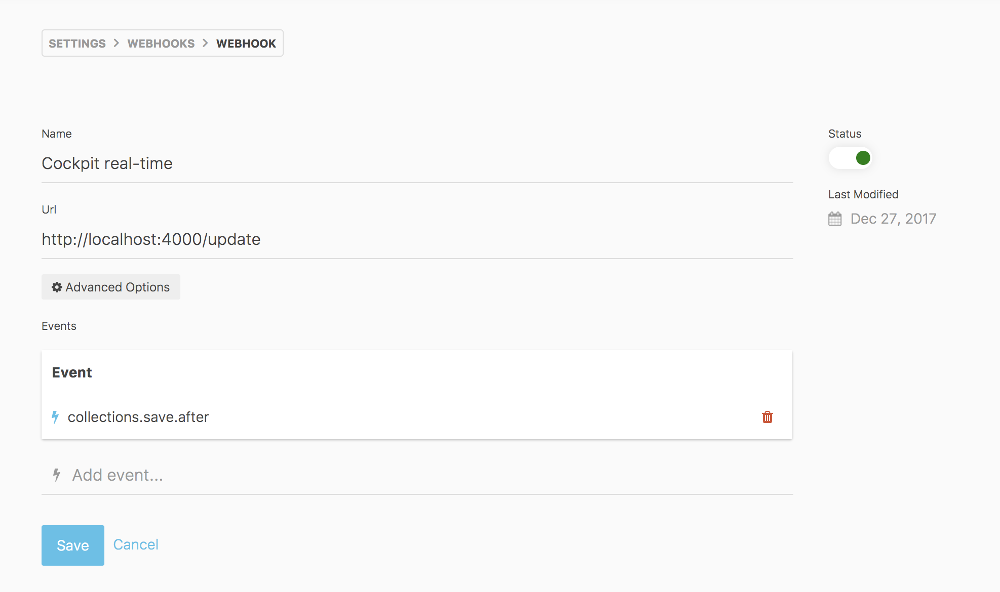
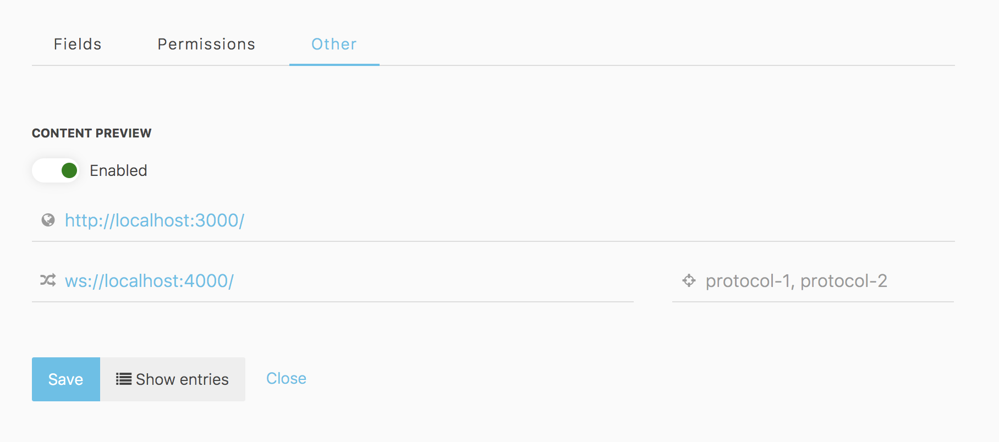

# Cockpit Real-time Server

This is a Websocket Middleware server for [Cockpit Headless CMS](https://github.com/agentejo/cockpit).

You can use the following [Javascript SDK](https://github.com/brunnolou/cockpit-sdk) to get real-time updates.

## Cockpit Webhook

Add a Webhook to Cokpit with the following settings:

* **Url**: `http://localhost:4000/update`

  Or the public address where the server is hosted

* **Events**:

  You must add at least one event. e.g.:

	- `collections.save.after`
	- `collections.save.after.portfolio`

  * 

## Preview collections
Edit each collection and add the following settings:

* **Preview URL**: _The http url where you can see the changes_.
* **Websocket**: `ws://localhost:4000/`

- 

### Installation

```sh
npm install
```

### Start

```sh
npm start
```

### Development

```sh
npm start
```

### Deployment

You can easily deploy with [Zeit Now](https://zeit.co/now)

```sh
npm deploy
```
